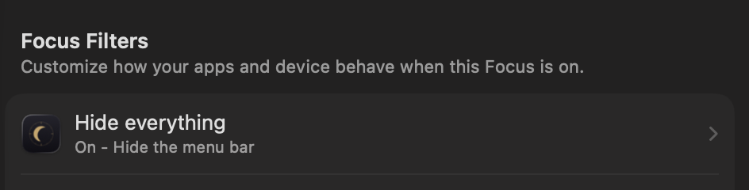

<!-- dcj-tag:start -->
```
██████╗  ██████╗     ██╗
██╔══██╗██╔════╝     ██║
██║  ██║██║          ██║
██║  ██║██║     ██   ██║
██████╔╝╚██████╗╚█████╔╝
╚═════╝  ╚═════╝ ╚════╝
d o t c o m j a c k
```
<!-- dcj-tag:end -->

# Nocturne

**Your Focus already silences your phone. Now it silences the clock.**

You flip Do Not Disturb before a deep block, the way you have a thousand times.
The phone goes quiet. Notifications stop. Every device you own agrees that you
are working, and the one thing still talking to you is the clock in the corner
of your own Mac, which is the interruption nobody ever gave you a switch for.

Nocturne is that switch, and as of 1.3.0 you do not have to touch it. Turn on a
Focus anywhere in your ecosystem, from your iPhone, from the Watch, from Control
Center, and your Mac's menu bar goes with it. Turn the Focus off and it comes
back exactly as it was.


macOS 14 or later. No permissions. No private APIs. No account. Around 3,500
lines of Swift, of which roughly a third is the comments explaining what was
measured and why.

---

## The part worth stealing even if you never install this

**You cannot hide the macOS menu bar clock.** Not with a checkbox, and not with
any of the `defaults` incantations that turn up when you search for it.

The clock is the one menu bar item Apple gives no visibility toggle. In System
Settings under Menu Bar, Siri, Spotlight, Wi-Fi, Bluetooth, Battery and AirDrop
all have a checkbox. Clock has a **Clock Options** button and nothing else.

Three widely repeated tricks are dead. Measured on macOS 26.3.1 by reading the
on-screen width of Control Center's `Clock` window before and after each write:

| Approach | Clock width |
|---|---|
| Baseline, `Sat Aug 8 2:43 AM` | 142pt |
| `defaults -currentHost write com.apple.controlcenter Clock -int 8` | 142pt, no effect |
| `defaults write com.apple.controlcenter "NSStatusItem VisibleCC Clock" -bool false` | 142pt, no effect |
| `defaults write com.apple.menuextra.clock DateFormat -string " "` | 142pt, no effect |
| **`defaults write com.apple.menuextra.clock IsAnalog -bool true`** | **44pt** |

`_HIHideMenuBar` and `AutoHideMenuBarOption` do not work either. Both store fine,
and System Settings reads the value back correctly, but neither applies without a
logout, which makes them useless for a toggle.

So the trick is not to hide the clock. It is to make it **unreadable**. An analog
dial at 44pt still tells the time, in the sense that a sundial in another room
tells the time. Your eye stops catching it, and nothing is hidden, moved, or
drawn over.

**Measure, do not screenshot.** Every number above came from
`CGWindowListCopyWindowInfo`, reading the clock window's width directly.
Sleep-and-screenshot lied twice during development: Control Center takes a few
seconds to repopulate after a restart, and a screenshot taken during that gap
shows an empty menu bar that looks exactly like a successful hide.

**And the window list has a trap in it.** `kCGWindowBounds` is free to read, but
`kCGWindowName` is gated behind Screen Recording. An early version of the locator
filtered on `name == "Clock"` and appeared to work perfectly, because it was
being launched from a terminal and inheriting that terminal's permission.
Launched normally as an app it returned nothing, silently:

| launched as | windows with a readable name | clock found |
|---|---|---|
| bare binary from Terminal | 10 | yes |
| `.app` via `open` | 0 | **no** |

So Nocturne identifies the clock by **where it sits**, never by what it is
called. If you test anything against the window list, test it as a real app
bundle, not from your shell.

---

## Install

**[Download Nocturne 1.4.1](https://github.com/dotcomjack/nocturne/releases/latest)**,
open the disk image, drag it to Applications.

Or with Homebrew:

```sh
brew install --cask dotcomjack/tap/nocturne
```

Signed with a Developer ID and notarized by Apple, so it opens on a double click
with no right-click-to-open dance and no Gatekeeper warning. The disk image is
notarized and stapled too, not just the app inside it. Universal, Apple silicon
and Intel.

Or build it yourself, which is the point of it being MIT:

```sh
git clone https://github.com/dotcomjack/nocturne.git
cd nocturne
./build.sh
```

Requires [xcodegen](https://github.com/yonaskolb/XcodeGen) (`brew install
xcodegen`) and Xcode.

## Use

The menu bar icon is the whole interface. **Click it** for modes, settings and
quit, the same as every other menu bar app.

Five modes:


| Mode | What it does |
|---|---|
| **Clock visible** | Normal macOS clock. |
| **Blind** *(default)* | Analog dial. The time is there, you just cannot read it. |
| **Gone** | A patch drawn over just the clock. Experimental, see below. |
| **Hide everything** | The whole menu bar goes blank, except Nocturne's own icon. Clicks still work, you just cannot read it. |
| **Only the clock** | Everything but the clock goes blank. Hide everything turned inside out, for whoever's problem is the icons rather than the time. |

Those are real captures of one menu bar on macOS 26.6.2, not mockups. The faint
band at the right of the **Gone** row is the seam described below, left in
rather than retouched out.

**Hover to show** hands the bar back on demand. Turn it on and the cover drops
away while the pointer is on the menu bar, then comes back when the pointer
leaves, so you can read the time by going to look for it rather than by changing
a setting. Off by default, and offered only in **Gone**, **Hide everything** and
**Only the clock**: **Blind** hides the time by writing Control Center's own
preference, and undoing
that costs a Control Center restart, which is far too slow to spend on a hover.
It costs no permission either, because macOS gates key events behind
accessibility and leaves mouse events alone. On more than one display only the
bar you are actually pointing at uncovers.

## Follow Focus

**Turn on Do Not Disturb on your phone. Your Mac's menu bar goes dark too.**

Focus is already the thing you flip when you want the world to leave you alone,
and it already syncs across everything signed into your iCloud account. Nocturne
hooks into it, so the switch you were already pressing now does one more useful
thing.

It is a **Focus filter**, which means it lives where macOS puts these, not in a
settings pane of mine. Set it up once:

**System Settings** > **Focus** > pick a Focus > **Add Filter** > **Nocturne** >
choose a mode.



That is the whole setup. Start that Focus and the menu bar goes. End it and the
mode you were on comes back. Set it on Do Not Disturb only, or on Work and Sleep
too, whichever ones you actually want it for. It is per Focus, so there is no
"any Focus / this Focus" switch to get wrong.

**It costs no permission at all.** Not Full Disk Access, not Accessibility, not
Screen Recording, not a Focus prompt. macOS tells Nocturne when the Focus starts
and ends, the same way it tells Mail and Safari. Measured, the whole round trip
from the system recording the Focus to Nocturne's code running is **18ms**.

**It gives the mode back, and it knows when not to.** Nocturne remembers what
you were on before the Focus started and returns you to it, including across a
quit or a crash, because the app can be killed while a Focus is running and you
should still get your own mode back. But if you pick a different mode *by hand*
while the Focus is on, it leaves your choice alone. An automation that yanks the
wheel back the second your Focus ends is worse than no automation.

### The two obvious ways to build this are both wrong

This is the part worth reading even if you never install anything.

**Reading `~/Library/DoNotDisturb/DB/Assertions.json` is a trap.** It is the
answer every search result gives. It is plain JSON, it names the exact Focus,
and it works perfectly right up until you ship, because that directory is TCC
protected and reading it needs **Full Disk Access**. The identical binary, in
two launch contexts on macOS 26.4:

| launched as | `isReadableFile` | `open(O_EVTONLY)` |
|---|---|---|
| bare binary from Terminal | `true` | fd 3 |
| `.app` via `open` | **`false`** | **-1, EPERM** |

and the kernel says so out loud:

```
System Policy: Nocturne(99186) deny(1) file-read-data
  /Users/…/Library/DoNotDisturb/DB/Assertions.json
```

It reads fine from a shell only because Terminal already holds Full Disk Access.
**That is the same trap this project already documents for `kCGWindowName`**, one
section up, and I walked straight into it a second time in the same codebase.
Test it as a real app bundle, not from your shell. A clock utility asking for
Full Disk Access is absurd, so that route is closed rather than inconvenient.

**`INFocusStatusCenter` costs a permission and then answers too little.** It is
Apple's public Focus API and it prompts the user. It reports a single optional
boolean, so it can never tell you *which* Focus is on. And unauthorised it does
not fail, it lies: measured on 26.4, polling every two seconds while Do Not
Disturb was genuinely on, it returned `Optional(false)` every single time. A
silent wrong answer is worse than an error.

### The undocumented part: telling "Focus started" from "Focus ended"

Apple's own dialog promises that "selected apps will be notified when this Focus
turns on or off", and nothing anywhere says how to tell the two apart. Both
calls arrive as the same `perform()` with the same parameters. With a
non-optional parameter they are genuinely indistinguishable:

```swift
@Parameter(title: "Mode", default: .hideEverything) var mode: FocusFilterMode

Focus ON    perform() mode=hideEverything
Focus OFF   perform() mode=hideEverything     // identical, useless
```

Make the parameter **optional** and the difference appears:

```swift
@Parameter(title: "Mode") var mode: FocusFilterMode?

Focus ON    perform() mode=Optional(hideEverything)
Focus OFF   perform() mode=nil
```

`nil` is the deactivation signal, and it is the only one there is. The same rule
governs `NocturneFocusFilter.current`, which is what makes a pull-based check
possible at launch and after sleep: with a default value it kept reporting the
configured mode long after the Focus had ended.

So if you build one of these: **do not give the parameter a default value to
tidy up the picker.** You lose the ability to detect the Focus ending, your app
engages on both edges and never releases, and the effect stays on forever.

One more measured thing, since it changes how you have to write `perform()`:
**macOS calls it more than once per transition.** Two calls 588ms apart for a
single Do Not Disturb toggle. Whatever you do in there has to be idempotent, or
one flip of a switch does the work twice.

Settings also exposes the same switches as System Settings under Menu Bar and
Clock Options, so you can drop just the date, just the day, or just AM/PM without
touching a mode. The menu bar icon can shimmer on a timer, off by choice, with a
700ms sweep top to bottom. Those are real, and each one is measured:

Each row below **adds to the one above it**, it is a ladder rather than four
independent settings:

| Setting | Clock width |
|---|---|
| Baseline | 142pt |
| Day of week off | 119pt |
| + Date set to Never | 76pt |
| + AM/PM off | 55pt |
| + Blind | 44pt |

## About Gone

Gone works, and it is honestly labelled experimental.

It draws a small window over Control Center's clock, re-finding the rect every
two seconds so it survives the menu bar reflowing, and tearing itself down in
full screen so it never floats over a video. Clicks pass through, so the clock
still opens if you hit it.

**It leaves a faint seam.** The Tahoe menu bar is translucent over your
wallpaper, so any window drawn above it blurs an already-translucent layer and
tints on top, which always lands darker than the bar. Eight materials were
measured against a live bar of `rgb(124,106,33)`:

```
hudWindow              36.7   <- shipped default
popover                54.7
titlebar               64.5
menu                   65.9
sidebar                77.4
underWindowBackground  77.4
headerView             89.0
windowBackground      110.3
```

An exact match means sampling real screen pixels, which costs a Screen Recording
prompt. **Nocturne will not ask for that**, because a clock utility has no
business holding permission to read your screen. Reading the wallpaper file
instead does not work either: the stock Tahoe wallpaper is dynamic, and its first
frame decoded to `rgb(21,89,153)` while the bar on screen was `rgb(124,106,33)`.

Gone turns the clock analog first, so the patch covers 44pt instead of 142pt. A
mismatch across 44pt reads as a smudge. Across 142pt it reads as a bug.

If the seam bothers you, use Blind. It is the default for a reason.

**Hide everything keeps its own icon lit.** Blanking the bar would otherwise
hide the one control that turns it back on, so the glyph is redrawn on top of
the strip. Clicks pass straight through it to the real status item, so the menu
opens normally.

**Hide everything has no seam**, which is counterintuitive but follows directly
from the above. A patch over part of the bar has neighbours it has to match. A
patch over the *whole* bar has none: its only edge is the bar's own bottom edge,
which is already a boundary. So the mode that covers the most is the one that
looks cleanest.

## Only the clock

**Hide everything turned inside out.** The strip runs from the bar's left edge
to the clock's left edge and stops, so every icon goes and the time stays
exactly as readable as it was. It is for the person whose problem is the twenty
icons rather than the clock, and it is offered everywhere the other modes are,
including the Focus filter picker, so a Focus can put every icon away and leave
the time.

**Nothing is drawn to the right of the clock, because there is nothing there.**
Measured on macOS 26.6.2, the clock's window runs to the screen edge on a
notched MacBook (x=1588 and 142pt wide on a 1728pt screen, so it overhangs by
2pt) and sits flush on an external display. A second strip there would be a
dark sliver beside the clock with nothing under it, which reads as a bug.

**It leaves exactly one seam**, the vertical edge where the strip stops at the
clock, so Settings offers the fill picker for it as it does for Gone. And it is
the one covering mode that leaves `IsAnalog` alone, because the clock has to
stay readable: coming to it from Blind, Gone or Hide everything puts the digital
clock back and waits for Control Center to settle before the strip goes up,
on the same path the analog swap already used.

The arithmetic is twenty lines in `MenuBarGeometry`, Foundation-only so the
test suite can fuzz it without a window server: 20,000 random bar and clock
layouts, and the strip never reaches the clock and never leaves the bar.

## Getting your clock back

**Nocturne adopts your existing Clock Options the first time it runs.** It reads
whatever you already had set in System Settings and starts from there, rather
than imposing its own defaults on you. It also snapshots that state, so Settings
can put your Clock Options back as they were.

One honest caveat: restoring always lands on a **digital** clock. If you were
already running the analog menu bar clock before installing Nocturne, you get a
digital one back. That is deliberate, because Nocturne's own preferences can be
cleared while the clock is analog, and treating that as "original" would restore
you to analog permanently.

On its own, Nocturne changes exactly one key: `IsAnalog`. It only writes the
other four when you move a switch in its Settings window yourself.

It restores `IsAnalog` when you quit, including on `pkill` and Activity Monitor's
Quit. If it ever dies badly and leaves the clock analog:

```sh
defaults write com.apple.menuextra.clock IsAnalog -bool false
killall ControlCenter
```

That is the entire undo, and it needs no app installed to work.

## What it does not do

- It does not *manage* other menu bar items. Hide everything and Only the clock blank the whole bar, but if you want per-icon control, ordering and hidden sections, that is [Ice](https://github.com/jordanbaird/Ice), which is excellent and does it properly.
- It does not cover a display whose current Space is a full-screen app unless the menu bar is set to stay visible there. With the default setting the bar slides away in full screen and there is nothing to cover, so the strip stays out of that Space on purpose and never floats over a video. Set the bar to stay (Never, or On Desktop Only) and that display is covered like any other, measured with Safari full screen on an external panel.
- It does not use private APIs, so it will not break on a macOS update.
- It does not ask for Accessibility or Screen Recording.
- It does not phone home, and there is nothing to phone home about.

## Why

Built by [DotcomJack](https://dotcomjack.com), who works a day job and builds at
night, and got tired of the clock ending the session before the work did.

MIT licensed. Take it apart.
