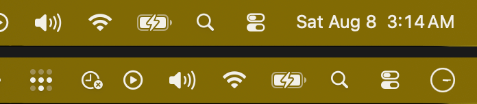

# Nocturne

**Stop your menu bar clock from telling you it is 3am.**

You are deep in something good. Your eye flicks to the corner out of habit, reads
`3:14 AM`, and the work is over. Not because you got tired, because you got told.

Nocturne takes the clock away, in one click, and gives it back the same way.



macOS 14 or later. No permissions. No private APIs. Around 1,000 lines of Swift.

---

## The part worth stealing even if you never install this

**You cannot hide the macOS menu bar clock.** Not with a checkbox, and not with
any of the `defaults` incantations that turn up when you search for it.

The clock is the one menu bar item Apple gives no visibility toggle. In System
Settings under Menu Bar, Siri, Spotlight, Wi-Fi, Bluetooth, Battery and AirDrop
all have a checkbox. Clock has a **Clock Options** button and nothing else.

Three widely repeated tricks are dead. Measured on macOS 26.3.1 by reading the
on-screen width of Control Center's `Clock` window before and after each write:

| Approach | Clock width |
|---|---|
| Baseline, `Sat Aug 8 2:43 AM` | 142pt |
| `defaults -currentHost write com.apple.controlcenter Clock -int 8` | 142pt, no effect |
| `defaults write com.apple.controlcenter "NSStatusItem VisibleCC Clock" -bool false` | 142pt, no effect |
| `defaults write com.apple.menuextra.clock DateFormat -string " "` | 142pt, no effect |
| **`defaults write com.apple.menuextra.clock IsAnalog -bool true`** | **44pt** |

`_HIHideMenuBar` and `AutoHideMenuBarOption` do not work either. Both store fine,
and System Settings reads the value back correctly, but neither applies without a
logout, which makes them useless for a toggle.

So the trick is not to hide the clock. It is to make it **unreadable**. An analog
dial at 44pt still tells the time, in the sense that a sundial in another room
tells the time. Your eye stops catching it, and nothing is hidden, moved, or
drawn over.

**Measure, do not screenshot.** Every number above came from
`CGWindowListCopyWindowInfo`, reading the clock window's width directly.
Sleep-and-screenshot lied twice during development: Control Center takes a few
seconds to repopulate after a restart, and a screenshot taken during that gap
shows an empty menu bar that looks exactly like a successful hide.

**And the window list has a trap in it.** `kCGWindowBounds` is free to read, but
`kCGWindowName` is gated behind Screen Recording. An early version of the locator
filtered on `name == "Clock"` and appeared to work perfectly, because it was
being launched from a terminal and inheriting that terminal's permission.
Launched normally as an app it returned nothing, silently:

| launched as | windows with a readable name | clock found |
|---|---|---|
| bare binary from Terminal | 10 | yes |
| `.app` via `open` | 0 | **no** |

So Nocturne identifies the clock by **where it sits**, never by what it is
called. If you test anything against the window list, test it as a real app
bundle, not from your shell.

---

## Install

**[Download Nocturne 1.1.1](https://github.com/dotcomjack/nocturne/releases/latest)**,
open the disk image, drag it to Applications.

Or with Homebrew:

```sh
brew install --cask dotcomjack/tap/nocturne
```

Signed with a Developer ID and notarized by Apple, so it opens on a double click
with no right-click-to-open dance and no Gatekeeper warning. The disk image is
notarized and stapled too, not just the app inside it. Universal, Apple silicon
and Intel.

Or build it yourself, which is the point of it being MIT:

```sh
git clone https://github.com/dotcomjack/nocturne.git
cd nocturne
./build.sh
```

Requires [xcodegen](https://github.com/yonaskolb/XcodeGen) (`brew install
xcodegen`) and Xcode.

## Use

The menu bar icon is the whole interface. **Click it** for modes, settings and
quit, the same as every other menu bar app.

Four modes:


| Mode | What it does |
|---|---|
| **Clock visible** | Normal macOS clock. |
| **Blind** *(default)* | Analog dial. The time is there, you just cannot read it. |
| **Gone** | A patch drawn over just the clock. Experimental, see below. |
| **Hide everything** | The whole menu bar goes blank, except Nocturne's own icon. Clicks still work, you just cannot read it. |

Those are real captures of one menu bar on macOS 26.3.1, not mockups. The faint
band at the right of the **Gone** row is the seam described below, left in
rather than retouched out.

Settings also exposes the same switches as System Settings under Menu Bar and
Clock Options, so you can drop just the date, just the day, or just AM/PM without
touching a mode. The menu bar icon can shimmer on a timer, off by choice, with a
700ms sweep top to bottom. Those are real, and each one is measured:

Each row below **adds to the one above it**, it is a ladder rather than four
independent settings:

| Setting | Clock width |
|---|---|
| Baseline | 142pt |
| Day of week off | 119pt |
| + Date set to Never | 76pt |
| + AM/PM off | 55pt |
| + Blind | 44pt |

## About Gone

Gone works, and it is honestly labelled experimental.

It draws a small window over Control Center's clock, re-finding the rect every
two seconds so it survives the menu bar reflowing, and tearing itself down in
full screen so it never floats over a video. Clicks pass through, so the clock
still opens if you hit it.

**It leaves a faint seam.** The Tahoe menu bar is translucent over your
wallpaper, so any window drawn above it blurs an already-translucent layer and
tints on top, which always lands darker than the bar. Eight materials were
measured against a live bar of `rgb(124,106,33)`:

```
hudWindow              36.7   <- shipped default
popover                54.7
titlebar               64.5
menu                   65.9
sidebar                77.4
underWindowBackground  77.4
headerView             89.0
windowBackground      110.3
```

An exact match means sampling real screen pixels, which costs a Screen Recording
prompt. **Nocturne will not ask for that**, because a clock utility has no
business holding permission to read your screen. Reading the wallpaper file
instead does not work either: the stock Tahoe wallpaper is dynamic, and its first
frame decoded to `rgb(21,89,153)` while the bar on screen was `rgb(124,106,33)`.

Gone turns the clock analog first, so the patch covers 44pt instead of 142pt. A
mismatch across 44pt reads as a smudge. Across 142pt it reads as a bug.

If the seam bothers you, use Blind. It is the default for a reason.

**Hide everything keeps its own icon lit.** Blanking the bar would otherwise
hide the one control that turns it back on, so the glyph is redrawn on top of
the strip. Clicks pass straight through it to the real status item, so the menu
opens normally.

**Hide everything has no seam**, which is counterintuitive but follows directly
from the above. A patch over part of the bar has neighbours it has to match. A
patch over the *whole* bar has none: its only edge is the bar's own bottom edge,
which is already a boundary. So the mode that covers the most is the one that
looks cleanest.

## Getting your clock back

**Nocturne adopts your existing Clock Options the first time it runs.** It reads
whatever you already had set in System Settings and starts from there, rather
than imposing its own defaults on you. It also snapshots that state, so Settings
can put your Clock Options back as they were.

One honest caveat: restoring always lands on a **digital** clock. If you were
already running the analog menu bar clock before installing Nocturne, you get a
digital one back. That is deliberate, because Nocturne's own preferences can be
cleared while the clock is analog, and treating that as "original" would restore
you to analog permanently.

On its own, Nocturne changes exactly one key: `IsAnalog`. It only writes the
other four when you move a switch in its Settings window yourself.

It restores `IsAnalog` when you quit, including on `pkill` and Activity Monitor's
Quit. If it ever dies badly and leaves the clock analog:

```sh
defaults write com.apple.menuextra.clock IsAnalog -bool false
killall ControlCenter
```

That is the entire undo, and it needs no app installed to work.

## What it does not do

- It does not *manage* other menu bar items. Hide everything blanks the whole bar, but if you want per-icon control, ordering and hidden sections, that is [Ice](https://github.com/jordanbaird/Ice), which is excellent and does it properly.
- It does not use private APIs, so it will not break on a macOS update.
- It does not ask for Accessibility or Screen Recording.
- It does not phone home, and there is nothing to phone home about.

## Why

Built by [DotcomJack](https://dotcomjack.com), who works a day job and builds at
night, and got tired of the clock ending the session before the work did.

MIT licensed. Take it apart.
